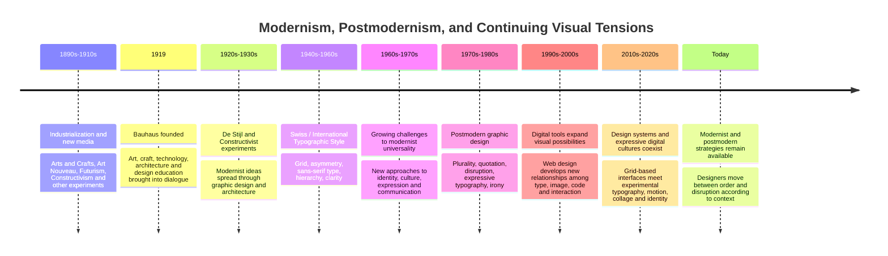
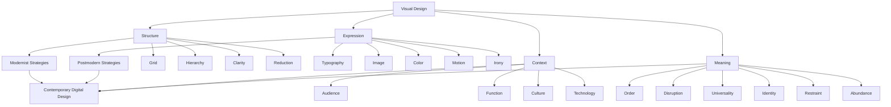

# Chapter 3 — Modernism, Postmodernism, and Visual Language

## Why This Matters

Visual design does more than make information attractive. It organizes attention, establishes relationships, creates expectations, and signals what kind of thing we are looking at.

A typeface can make a product feel institutional or playful. A grid can make information feel systematic. A deliberately broken grid can make the same information feel experimental or rebellious. A photograph can document an object, sell a lifestyle, or create an ironic distance from the object being sold.

These effects are not accidental. They come from choices about **visual language**: the recurring systems, conventions, forms, and attitudes through which design communicates.

This chapter follows one especially important historical tension. Modernist design often sought clarity, order, function, reduction, and broadly applicable visual systems. Postmodern design challenged the idea that one visual system could be neutral, universal, or appropriate for every context. It introduced greater emphasis on plurality, quotation, irony, disruption, identity, and expression.

Neither tradition disappeared. Contemporary digital design continually mixes them.

---

## A Short Historical Path into Modernism

Modernism was not a single style that suddenly appeared. It developed through a series of changes in art, architecture, technology, industry, and society during the late nineteenth and early twentieth centuries.

Industrial production changed how objects were made and distributed. New printing technologies expanded access to images and information. Photography changed ideas about representation. Cities grew rapidly, and designers encountered new forms of transportation, communication, advertising, and mass media.

At the same time, many artists and designers began questioning inherited conventions. Instead of treating historical styles as a fixed vocabulary to imitate, they experimented with abstraction, geometry, asymmetry, new materials, and new relationships between form and function.

Several movements contributed to this transition. Arts and Crafts challenged the effects of industrialization while also reconsidering the relationship between making and design. Art Nouveau explored organic forms and integrated visual systems. Futurism celebrated speed, machines, and modern life. De Stijl pursued geometric abstraction and a highly reduced visual vocabulary. Constructivism explored relationships among art, technology, communication, and social purpose.

These movements were different from one another, but together they helped establish an environment in which designers could ask a new question:

> What should visual form do in a modern society?

Modernism increasingly answered with ideas such as efficiency, legibility, structure, function, and reduction.

---

## Bauhaus

The **Bauhaus**, founded in Germany in 1919 by Walter Gropius, became one of the most influential schools in modern design history.

Its importance was not simply that it produced a recognizable "Bauhaus look." The school brought together art, craft, architecture, typography, product design, and education. Students were encouraged to investigate materials, geometry, color, structure, and methods of making.

The Bauhaus also helped establish an important modern design attitude: design could be treated as a problem to investigate rather than merely a surface to decorate.

Its history was complex and changed substantially as its directors and teachers changed. The school operated in Weimar, Dessau, and later Berlin before closing in 1933 under pressure from the Nazi regime. Teachers and students subsequently carried ideas associated with the school into other institutions and countries, helping spread aspects of modern design internationally.

### What to Notice

When looking at Bauhaus-related work, ask:

- What has been simplified?
- Which shapes are treated as fundamental?
- How are geometry and materials used?
- Is decoration doing a job, or has it been removed?
- How do type, image, object, and space relate to one another?
- Does the design appear to come from a repeatable system?

Do not reduce Bauhaus to "circles, squares, and primary colors." Its larger significance lies in experimentation, interdisciplinary education, making, and the search for relationships among form, material, production, and use.

---

## From Modernism to the Swiss / International Typographic Style

After World War II, a particularly influential form of modernist graphic design developed in Switzerland and spread internationally. It is commonly called the **Swiss Style** or **International Typographic Style**.

Designers associated with this tradition emphasized:

- structured grids
- sans-serif typography
- asymmetrical composition
- strong alignment
- controlled hierarchy
- photography or restrained imagery
- generous use of space
- objective or informational presentation
- consistency across related materials

The grid became especially important because it provided an underlying structure for organizing complex information.

A grid does not necessarily mean that every element must look identical. It provides a set of relationships: columns, margins, baselines, modules, and alignments that allow different elements to belong to the same system.

### The Grid as an Idea

Imagine a page containing:

- a headline
- a photograph
- a paragraph
- a caption
- a date
- a page number

Without a structure, these elements can compete unpredictably.

A grid creates relationships between them.

The headline may occupy two columns. The photograph may span three. The caption may align with the photograph's edge. The paragraph may begin on the same vertical line as another element elsewhere on the page.

The viewer may never consciously notice the grid. That is part of its power.

The system makes the page easier to organize and easier to read.

---

## Modernist Principles

Modernist design is easier to understand when its visual choices are treated as principles rather than a checklist of stylistic decorations.

### Grid

A grid creates an underlying structure for arranging information.

**Question:** What relationships are being established between elements?

### Hierarchy

Hierarchy controls the order in which information attracts attention.

Size, weight, position, spacing, contrast, and repetition can all create hierarchy.

**Question:** What does the viewer notice first, second, and third?

### Clarity

Clarity means making relationships and information easier to perceive.

Clarity does not necessarily mean making everything plain or boring. It means reducing unnecessary ambiguity when communication requires precision.

**Question:** What could the viewer misunderstand, and how does the design prevent that?

### Reduction

Reduction removes or simplifies elements that do not contribute sufficiently to the intended communication.

This can involve fewer typefaces, fewer colors, simpler shapes, less decoration, or a smaller number of competing visual signals.

**Question:** What happens if one element is removed?

### Function

Modernist thinking often connects form to purpose. A form should have a reason to exist in relation to use, communication, material, or production.

**Question:** What is this visual choice helping the user do?

These principles often overlap. A grid can improve clarity. Reduction can strengthen hierarchy. Function can justify a particular structure.

But principles are not laws.

A designer can intentionally break a grid. A designer can make something ambiguous. A designer can use excess rather than reduction. The important thing is understanding what the choice communicates.

---

## Modernism and the Idea of Universality

One of modernism's ambitions was to create systems that could work beyond a single historical style or decorative tradition.

A neutral sans-serif typeface, a rational grid, or a standardized visual system could appear to offer a shared visual language.

This ambition was powerful, but it also raised questions.

Can any visual language really be neutral?

Who decides what counts as clear?

Whose reading habits are treated as universal?

What happens to cultural difference, local identity, personal expression, or historical reference when design tries to eliminate them?

These questions become especially important when we move toward postmodernism.

---

## Postmodernism: A Reaction Against Certainty

Postmodern design should not be understood simply as "modernism, but messy."

It emerged from broader cultural and intellectual challenges to ideas of universal truth, stable meaning, progress, and objective authority. In architecture, graphic design, art, literature, and popular culture, designers and artists increasingly questioned whether one rational visual system could adequately represent a diverse and contradictory world.

In graphic design, this could mean deliberately disrupting the expectations established by modernist systems.

Instead of asking only:

> How can this information be made clearer?

a designer might also ask:

> How can this design communicate personality, context, ambiguity, cultural reference, or contradiction?

Postmodern approaches often embraced:

- **plurality** — multiple styles and references can coexist
- **irony** — a design can knowingly play with its own conventions
- **disruption** — order can be interrupted to create emphasis or tension
- **quotation** — historical styles can be borrowed, remixed, or placed in new contexts
- **expressive typography** — type can act as image, voice, texture, or personality
- **layering** — multiple meanings or visual signals can occupy the same space
- **identity** — design can foreground cultural, social, or personal specificity

The point is not that every postmodern design uses all of these characteristics. Rather, they represent a different attitude toward visual authority.

---

## Order and Disruption

One of the clearest ways to understand the modernist/postmodern tension is to compare **order** with **disruption**.

A modernist composition might use a grid to make relationships predictable.

A postmodern composition might visibly interrupt that grid.

But the important point is that disruption can also be systematic.

A designer might establish a regular grid and then deliberately break it in one location. The broken rule becomes meaningful because the viewer can sense the rule that was broken.

This gives us a useful principle:

> You cannot meaningfully break a visual system unless the audience can perceive, at least partially, the system being broken.

Anti-grid design therefore does not necessarily mean "no structure." It can mean **structure used as a visible tension**.

---

## Universality and Identity

Modernist systems often seek broad applicability. Postmodern approaches are more comfortable with specificity.

Consider a university website.

A universalist approach might emphasize:

- consistent typography
- standardized components
- predictable navigation
- neutral photography
- restrained color
- systematic spacing

An identity-centered approach might emphasize:

- local cultural references
- distinctive language
- unconventional imagery
- regional visual traditions
- expressive typography
- visual elements associated with a particular community

Neither approach automatically communicates better in every situation.

The design question is:

**What kind of relationship should the institution have with its audience?**

A public transit map may prioritize consistency and rapid comprehension. A cultural festival identity may need to communicate difference, energy, history, or belonging.

The context changes the appropriate balance.

---

## Clarity and Expression

Modernist design often treats visual ambiguity as something to control.

Expressive design may treat ambiguity as a resource.

Compare two event posters.

**Poster A** presents:

- event name
- date
- location
- time
- clear typographic hierarchy
- strong alignment

**Poster B** allows the event name to become part of an oversized typographic image. The date may be partially integrated into the composition. Some information may require more exploration.

Poster A may prioritize immediate information retrieval.

Poster B may prioritize atmosphere, identity, or emotional response.

This does not mean Poster B is "bad communication." It may be communicating a different kind of thing.

A first-year designer should learn to distinguish:

**difficulty caused by poor design**

from

**difficulty intentionally created as part of the design's meaning.**

---

## Grid and Anti-Grid

The grid is not the enemy of creativity.

A grid can produce:

- consistency
- rhythm
- alignment
- scalability
- responsive behavior
- faster production
- clearer information architecture

Breaking the grid can produce:

- surprise
- emphasis
- personality
- movement
- tension
- hierarchy through interruption

Contemporary design frequently combines both.

A product page may have a strict underlying layout system while allowing a campaign image or headline to overlap several columns.

The interface can therefore be structurally modernist while its promotional layer is expressive or postmodern.

---

## Restraint and Abundance

Modernist reduction often asks:

> What can be removed?

Postmodern abundance can ask:

> What happens when multiple references are allowed to coexist?

Abundance might mean:

- multiple type styles
- dense imagery
- overlapping elements
- competing scales
- decorative references
- historical quotations
- visible layers

But abundance without control can simply become noise.

This is why studying postmodern design does not mean learning to add random things. It means learning how visual excess can be intentional.

---

## Function and Irony

Modernist design often foregrounds use.

Postmodern design may foreground the fact that design is constructed.

A chair may look intentionally impractical. A poster may imitate an outdated advertisement while clearly knowing that it is doing so. A website may use a deliberately awkward interaction as a joke.

Irony introduces a second level of communication.

The design says:

1. "Here is the thing."
2. "And here is what I think about the way this kind of thing is usually presented."

That second layer can be powerful, but it depends heavily on context and audience.

---

## The Tension Continues in Digital Design

It is tempting to tell design history as a sequence:

**Modernism → Postmodernism → Contemporary design**

That sequence is too simple.

Contemporary digital design contains all of these tendencies at once.

A banking application might use:

- an eight-point spacing system
- a consistent grid
- standardized buttons
- restrained typography
- predictable navigation

These choices have a strong modernist logic: consistency, clarity, hierarchy, and function.

The same company might launch a marketing campaign using:

- oversized type
- animated objects
- intentionally strange compositions
- nostalgic references
- collage
- visual jokes

The campaign may use a more postmodern visual language.

Even within one screen, the tension can appear.

### Example: A Product Landing Page

Imagine a page selling headphones.

The underlying interface may be highly systematic:

- navigation aligned to a grid
- consistent margins
- standardized buttons
- clear pricing hierarchy
- predictable responsive behavior

But the hero section may:

- place the product at an unusual angle
- overlap type and photography
- use an unexpected typeface
- animate the headline
- quote visual styles from an earlier decade

The interface and the campaign are not necessarily contradictory.

The designer may be using **modernist structure to support postmodern expression**.

---

## Contemporary Digital Tensions

| Tension | One Side | Other Side | Contemporary Example |
|---|---|---|---|
| Order / Disruption | Stable grid and predictable alignment | Deliberate breaks and unexpected placement | A structured commerce page with an overlapping campaign hero |
| Universality / Identity | Generic, broadly reusable system | Local, cultural, or personal specificity | A design system adapted for different cultural audiences |
| Clarity / Expression | Immediate information retrieval | Atmosphere, ambiguity, or personality | A simple checkout flow paired with an expressive brand campaign |
| Grid / Anti-grid | Columns, modules, alignment | Overlap, asymmetry, irregular placement | Editorial websites that use a grid but let headlines cross columns |
| Restraint / Abundance | Limited type, color, and imagery | Layering, collage, visual density | Fashion or music sites combining photography, type, and animation |
| Function / Irony | Design supports direct use | Design comments on conventions or creates playful friction | A deliberately strange promotional interaction |
| Consistency / Difference | Reusable components | Individual expression within the system | A design system allowing branded, campaign-specific moments |
| Stability / Motion | Static hierarchy | Animation and transition as visual language | Interfaces where movement signals relationships or state changes |

The table is not a list of rules. It is a set of questions.

When you encounter a contemporary design, ask which side of each tension it emphasizes and where it deliberately moves between them.

---

## The Same White T-Shirt, Two Visual Languages

Return to the plain white T-shirt.

The physical product has not changed.

It is still a white T-shirt.

But design can make it feel like two very different products.

### A Modernist Presentation

Imagine the shirt photographed against a clean white or neutral background.

The composition is centered or carefully aligned.

The typography is restrained.

The product name is simple.

The price and material information have a clear hierarchy.

There is generous whitespace.

The page uses a consistent grid.

The visual message might become:

> This is a straightforward, well-designed object. Its value comes from its material, construction, utility, and simplicity.

The design reinforces the product's basic qualities.

### A Postmodern Presentation

Now imagine the exact same shirt presented through a dense collage.

The photograph is partially cropped.

The headline is oversized and overlaps the shirt.

The typography mixes references to different eras.

A deliberately awkward slogan appears beside the product.

The layout breaks conventional alignment.

A vintage-looking graphic is combined with contemporary type.

The visual message might become:

> This ordinary object is being turned into a cultural statement, a reference, a joke, or an identity signal.

The shirt has not changed.

The **visual language surrounding it** has changed.

This is one of the central lessons of design:

> Meaning is produced not only by the object itself, but also by how the object is framed, organized, labeled, photographed, and placed in context.

---

## How to Read a Design

When you encounter a poster, website, package, interface, advertisement, publication, or object, do not begin by asking whether you like it.

Begin by asking what it is doing.

### 1. Identify the Context

What is the design for?

- a public service?
- a product?
- a cultural event?
- an editorial article?
- an interface?
- an institution?
- entertainment?

What does the audience need to do?

### 2. Find the Hierarchy

What do you notice first?

Then what?

Then what?

Describe the sequence rather than simply saying that something "stands out."

### 3. Look for the Structure

Is there a visible or invisible grid?

Look for:

- repeated alignments
- columns
- margins
- baseline relationships
- consistent spacing
- repeated modules

### 4. Examine Typography

Ask:

- What typefaces are being used?
- How many?
- What changes in size or weight?
- Is type primarily informational?
- Is it also expressive?
- Does the typography behave like an image?

### 5. Examine Image and Space

Ask:

- What is photographed or illustrated?
- How is it cropped?
- How much empty space exists?
- Are elements overlapping?
- Is the composition dense or sparse?

### 6. Identify the Rules

What visual rules seem to govern the design?

For example:

- everything aligns to a left edge
- all images have the same width
- headlines use one type family
- colors are limited
- spacing follows a repeated rhythm

### 7. Look for Rule-Breaking

Does anything violate the apparent system?

If so, ask why.

A broken rule may create:

- emphasis
- surprise
- humor
- movement
- identity
- ambiguity

### 8. Consider Historical References

Does the design remind you of another period or style?

Look for quotation, imitation, revival, or remix.

Do not assume that resemblance proves direct influence. Instead, describe the visual relationship and investigate further.

### 9. Ask What Kind of Meaning Is Being Produced

Finally:

> What does the design want you to believe, feel, understand, notice, or do?

A design may communicate several things simultaneously.

---

## Museum Research

Historical design should be studied through actual objects whenever possible.

Online image searches can be useful for discovery, but search results often remove context. A cropped image may omit the title, date, designer, collection, medium, provenance, or surrounding works that help explain what you are seeing.

For research, begin with **museum and institutional collections**.

Possible starting points include:

- The Metropolitan Museum of Art
- The Museum of Modern Art (MoMA)
- Cooper Hewitt, Smithsonian Design Museum
- Victoria and Albert Museum (V&A)
- Bauhaus archives and institutional resources
- National museums, university collections, design archives, and other established cultural institutions

Do not assume that a museum's search results will contain exactly the example you have in mind. Use these institutions as research environments.

### Search Instructions

When searching an institutional collection, combine a **designer, movement, object type, or concept** with a date or medium when useful.

Try searches such as:

- `Bauhaus typography`
- `Bauhaus poster`
- `Swiss Style graphic design`
- `International Typographic Style`
- `Josef Müller-Brockmann poster`
- `Armin Hofmann graphic design`
- `Herbert Bayer typography`
- `modernist poster grid`
- `postmodern graphic design typography`
- `expressive typography`
- `experimental typography`
- `graphic design grid`
- `design system poster`
- `20th century graphic design`

For museum databases, also try broader terms such as:

- `poster`
- `type`
- `advertisement`
- `book design`
- `package design`
- `textile`
- `photograph`
- `furniture`
- `interface`
- `graphic design`

### Verify the Object

Before using an example in an assignment, verify:

1. The object actually exists in the collection.
2. The institution identifies it as the object you think it is.
3. The date and designer information are accurate.
4. You understand what the object actually is.
5. You can distinguish the museum's description from your own interpretation.

Do not fabricate a title, date, designer, collection record, or URL because an example sounds plausible.

If a search engine shows an image without reliable provenance, treat it as a lead for further research rather than as evidence.

### Compare Objects, Not Just Styles

Choose two or three authentic objects and compare them.

For each object, record:

- institution
- object title
- designer or maker, if identified
- date
- medium
- visual structure
- typography
- image strategy
- historical context
- source page

Then ask:

> What visual problem is each designer solving?

This question is usually more useful than asking which object is "more modern."

---

## A Mermaid Timeline

The following timeline is a simplified teaching model. It is not intended to imply that design history follows a single straight line.

The key point is at the end of the timeline: **history does not require designers to choose one style forever.**

A contemporary designer can use a Swiss-style grid, a postmodern visual quotation, a minimalist interface, and an expressive animated campaign within the same project.

---

## A Concept Map: One Design, Many Questions

---

## A Practical Exercise

Choose one contemporary website, app, poster, packaging system, or advertisement.

Analyze it twice.

### Pass One: Look for Modernist Logic

Find:

- grids
- hierarchy
- repetition
- consistency
- reduction
- functional relationships
- standardized components

### Pass Two: Look for Postmodern Logic

Find:

- quotation
- irony
- disruption
- expressive typography
- visual excess
- cultural references
- deliberate ambiguity
- identity

Then write three sentences:

1. **The design creates order by...**
2. **The design creates disruption or expression by...**
3. **The tension between these approaches helps communicate...**

This exercise trains you to see design as a system of choices rather than as a collection of stylistic labels.

---

## What You Should Remember

1. **Modernism was not one style.** It developed through many experiments responding to industrialization, technology, new media, and changing ideas about art and society.

2. **Bauhaus matters because of its approach as much as its appearance.** It connected art, craft, technology, materials, education, and design practice.

3. **The Swiss / International Typographic Style made structure highly visible.** Grid, hierarchy, asymmetry, typography, photography, and clarity became powerful tools for organizing information.

4. **Modernist principles are useful tools, not commandments.** Grid, hierarchy, clarity, reduction, and function help designers make intentional decisions.

5. **Postmodernism challenged visual certainty.** Plurality, irony, disruption, quotation, and expressive typography opened design to more contradictory and context-specific forms of communication.

6. **The modernist/postmodernist tension is still alive.** Contemporary digital design can be systematic and expressive, restrained and abundant, functional and ironic.

7. **Breaking a rule is different from having no rules.** A deliberate anti-grid or disruption often works because the viewer can sense the underlying structure.

8. **Visual language changes how objects are perceived.** The same plain white T-shirt can communicate simplicity and utility in one presentation and irony, identity, or cultural reference in another.

9. **Read design before judging it.** Ask what the design is organizing, emphasizing, hiding, quoting, disrupting, and communicating.

10. **Study authentic examples.** Use museum and institutional collections to verify objects, dates, designers, and context. Treat unverified search results as leads, not evidence.

The goal is not to become a modernist or a postmodernist.

The goal is to recognize the visual decisions available to you—and to understand what those decisions can make a design say.
