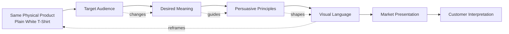

# Chapter 4 — The White T-Shirt Case Study

## One Shirt, Four Different Meanings

Imagine a product that is almost aggressively ordinary:

**A high-quality plain white T-shirt.**

No giant logo. No unusual cut. No elaborate pattern. No technological gimmick.

The physical shirt stays substantially the same throughout this chapter.

What changes is everything around it.

We will present the same shirt to four different audiences using four different combinations of:

- audience
- brand archetype
- persuasion
- visual language
- story
- imagery
- meaning

This is the central lesson:

> A product does not enter the market carrying one permanent meaning. Design, language, context, and persuasion help construct the meaning people encounter.

The shirt is the constant.

The presentation changes.

---

## First: What Are We Actually Selling?

It would be easy to say that we are selling a T-shirt.

But customers rarely buy only the physical object.

A person might buy a plain white T-shirt because they want:

- reliability
- simplicity
- status
- belonging
- freedom
- self-expression
- practicality
- nostalgia
- environmental responsibility
- a feeling of sophistication
- a feeling of rebellion

The physical product may satisfy several of these needs at once, but the **presentation tells the customer which meaning to notice**.

That makes the white T-shirt an unusually useful design exercise.

There is almost nowhere for the designer to hide.

If the shirt is plain, the typography, photography, layout, language, model, setting, color, pacing, and story have to do much of the persuasive work.

---

# Concept One — The Essential

### Position

**The Essential** presents the shirt as an exercise in disciplined simplicity.

### Target Audience

People who value:

- simplicity
- quality
- consistency
- functional products
- uncluttered environments
- understated aesthetics

The audience is not necessarily interested in fashion as spectacle. They may want clothing that fits easily into an organized wardrobe.

### Brand Archetype

**The Sage**

The brand behaves like a knowledgeable guide.

It does not shout:

> LOOK AT ME.

Instead, it suggests:

> We have thought carefully about what is necessary.

The archetype works through competence, knowledge, and restraint.

### Persuasive Principles

The presentation uses:

- **clarity** — make the product easy to understand
- **authority** — communicate confidence through controlled presentation
- **reduction** — remove distractions
- **consistency** — create a coherent system across the brand
- **cognitive ease** — make the product easy to evaluate

There is also an important psychological effect in restraint: when very little competes for attention, small differences can become significant.

The weave of the fabric, the shape of the collar, or the construction of a seam can become part of the story.

### Visual Language

Strongly influenced by modernist and Swiss / International Typographic traditions:

- strict grid
- generous whitespace
- restrained typography
- clear hierarchy
- neutral background
- precise product photography
- limited visual effects
- consistent spacing
- asymmetrical but controlled composition

The design should feel like it could be part of a larger system.

### Headline

> **Nothing Extra. Everything Considered.**

### Short Product Story

The story is not about transformation.

It is about removing unnecessary decisions.

The shirt is presented as a dependable foundation: something that works under a jacket, with jeans, at home, or as part of a carefully edited wardrobe.

The product story says that quality does not need to perform loudly.

### Likely Imagery

Use:

- front and back product views
- close-ups of fabric and stitching
- carefully lit details
- a small number of restrained lifestyle photographs
- models in ordinary, believable settings
- compositions with substantial negative space

Photography should make the shirt easy to inspect.

### What Meaning Is the Customer Being Invited to Buy?

Not simply:

> "Buy a white T-shirt."

The invitation is:

> **Buy simplicity, competence, and control.**

The shirt becomes evidence that the wearer knows what matters and does not need unnecessary decoration.

### Ethical Risk or Limitation

Minimalism can imply quality without proving it.

A sparse website, beautiful typography, and precise photography can make an ordinary product appear more technically sophisticated than it really is.

The ethical rule is simple:

**Visual restraint should not be used to disguise weak evidence.**

If the shirt is expensive, claims about fabric, construction, durability, or sourcing should be supportable.

---

# Concept Two — The Explorer

### Position

**The Explorer** turns the same white shirt into a dependable companion for movement.

The shirt has not become more adventurous.

The story has.

### Target Audience

People who value:

- travel
- outdoor experiences
- independence
- flexibility
- discovery
- personal freedom

This could include travelers, students, creative professionals, hikers, cyclists, or anyone attracted to the idea of a less scripted life.

### Brand Archetype

**The Explorer**

The Explorer archetype emphasizes autonomy, discovery, and movement.

The product is not presented as the destination.

It is presented as equipment for the journey.

### Persuasive Principles

The presentation uses:

- **aspiration** — connect the product with a desired lifestyle
- **identity signaling** — help customers imagine themselves as adventurous
- **association** — place the shirt in environments associated with discovery
- **simplicity** — position the product as uncomplicated equipment
- **future projection** — invite the audience to imagine what they could do while wearing it

Notice that much of the persuasion comes from context rather than the physical object.

### Visual Language

The visual language is spacious but less clinical than Concept One.

Use:

- natural environments
- maps or directional graphics
- travel photography
- imperfect crops
- handwritten or field-note elements used selectively
- earthy visual references
- strong photography
- movement and changing scale

The underlying composition can still be organized, but the presentation should feel less controlled.

### Headline

> **Go Further. Pack Less.**

### Short Product Story

The shirt is presented as the dependable thing you do not have to think about.

It goes into the backpack.

It gets worn on the train.

It appears in a roadside photograph.

It survives an ordinary day away from home.

The product story is about reducing friction so the customer can focus on experience.

### Likely Imagery

Imagine:

- the shirt on a person standing near a trail
- a backpack containing the shirt
- a hotel room with clothing laid out before a trip
- a train platform
- a campsite
- a city street unfamiliar to the viewer
- close-up details of fabric against outdoor textures

The shirt should appear naturally integrated into the journey.

### What Meaning Is the Customer Being Invited to Buy?

> **Buy freedom from unnecessary complication.**

The customer is being invited to see the shirt as a tool for a mobile, self-directed life.

The product becomes a symbol of readiness.

### Ethical Risk or Limitation

Lifestyle imagery can create a false relationship between the product and the promised experience.

A photograph of a spectacular landscape does not prove that the shirt is durable, comfortable, sustainable, or technically suited to that environment.

There is also a broader risk:

> The product can sell the fantasy of adventure more effectively than the product itself deserves.

A responsible presentation separates emotional storytelling from factual product claims.

---

# Concept Three — The Disruptor

### Position

**The Disruptor** treats the white T-shirt as a joke about fashion, advertising, and the endless demand for novelty.

The product is ordinary.

The presentation refuses to behave ordinarily.

### Target Audience

People who value:

- cultural references
- humor
- experimentation
- visual novelty
- subcultural signals
- fashion and media awareness
- irony

### Brand Archetype

**The Jester**

The Jester uses humor, play, surprise, and irreverence.

Instead of saying:

> This is the perfect white T-shirt.

it might say:

> You already own one. Here's another.

### Persuasive Principles

The presentation uses:

- **surprise**
- **humor**
- **pattern interruption**
- **curiosity**
- **identity signaling**
- **ironic distance**
- **cultural recognition**

The customer is not only buying the shirt.

They are buying the joke about buying the shirt.

### Visual Language

This is the most deliberately postmodern presentation.

Use:

- disrupted grids
- oversized typography
- unexpected scale
- collage
- visual quotation
- mixed type styles
- awkward cropping
- deliberate contradiction
- historical references remixed into contemporary compositions
- abrupt changes in visual rhythm

The design may look as though several incompatible design systems have collided.

But the collision should be intentional.

### Headline

> **THE WHITE T-SHIRT. AGAIN.**

A smaller line could read:

> *Because apparently we weren't finished.*

### Short Product Story

The story begins with the absurdity of the product category.

Everyone has seen the white T-shirt.

Everyone has been told that some new white T-shirt is somehow essential.

So the campaign acknowledges the cliché instead of pretending it does not exist.

The shirt becomes an object of commentary.

The campaign says:

> Yes, this is a plain white T-shirt. We know.

That self-awareness becomes part of the brand.

### Likely Imagery

Use:

- aggressively cropped product photography
- multiple versions of the same photograph
- photocopy-like textures
- oversized words
- deliberately mismatched visual references
- repeated images
- unexpected negative space
- models posed in deliberately unglamorous ways
- visual jokes hidden in the composition

The product itself should remain relatively ordinary.

### What Meaning Is the Customer Being Invited to Buy?

> **Buy participation in the joke.**

The shirt becomes a cultural signal.

Wearing it can communicate that the customer recognizes the conventions of fashion advertising and is willing to play with them.

### Ethical Risk or Limitation

Irony can exclude people who do not understand the reference.

It can also become an excuse for weak communication.

A designer might claim that confusing or inaccessible work is "intentionally ironic" when it simply fails to communicate.

There is another risk: irony can make almost any claim seem acceptable because the brand can retreat behind:

> "We were joking."

A responsible designer should know when irony clarifies an idea and when it merely protects the brand from accountability.

---

# Concept Four — The Belonger

### Position

**The Belonger** presents the white T-shirt as a shared cultural object.

Instead of emphasizing individual uniqueness, it emphasizes connection.

### Target Audience

People who value:

- community
- belonging
- family
- friendship
- shared experiences
- everyday authenticity
- cultural or local identity

### Brand Archetype

**The Everyperson**

The Everyperson archetype emphasizes familiarity, accessibility, and belonging.

The brand should feel less like an exclusive club and more like an invitation.

### Persuasive Principles

The presentation uses:

- **social proof**
- **belonging**
- **familiarity**
- **relatability**
- **community identity**
- **emotional association**

The product becomes valuable because it participates in ordinary life.

### Visual Language

Use:

- documentary-style photography
- varied ages and appearances
- real-world environments
- natural gestures
- imperfect compositions
- handwritten or conversational copy
- local details
- repeated visual motifs
- a warmer, less controlled visual system

The design can still have a consistent identity, but it should not feel overly polished.

### Headline

> **Looks Like You. Goes With Everything.**

### Short Product Story

The shirt appears across different lives.

Someone wears it while making breakfast.

Someone wears it at a concert.

Someone wears it while helping a friend move.

Someone wears it under a work jacket.

Someone wears it while sitting outside on a summer evening.

The product's meaning comes from repetition across ordinary experiences.

It becomes a familiar object rather than a status object.

### Likely Imagery

Show:

- groups of friends
- families
- roommates
- coworkers
- different generations
- everyday neighborhoods
- informal gatherings
- ordinary moments rather than staged perfection

The photography should communicate that the shirt belongs in many people's lives.

### What Meaning Is the Customer Being Invited to Buy?

> **Buy belonging without having to perform for it.**

The shirt becomes a symbol of ordinary participation.

It says:

> You do not have to be exceptional to belong here.

### Ethical Risk or Limitation

"Authenticity" can itself become a marketing performance.

A brand can photograph diverse people and call that community while offering no meaningful relationship with the communities represented.

Representation should not be used as decoration.

There is also a risk of flattening difference: showing many people in the same shirt can communicate belonging, but it can also imply that everyone's experience is interchangeable.

---

# Four Shirts That Are Actually One Shirt

At this point, pause.

The physical shirt has barely changed.

Yet the four presentations ask customers to imagine four different identities:

- **The Essential:** "I value simplicity and considered choices."
- **The Explorer:** "I am ready to move through the world."
- **The Disruptor:** "I understand the joke and enjoy breaking conventions."
- **The Belonger:** "I am part of something ordinary and shared."

This is why visual design is not merely decoration applied after a product has been invented.

It helps establish the product's **position in culture**.

---

# Synthesis Table

| Concept | Target Audience | Archetype | Persuasive Principles | Visual Language | Customer Is Invited to Buy | Main Ethical Risk |
|---|---|---|---|---|---|---|
| **The Essential** | Simplicity- and quality-oriented consumers | Sage | Clarity, authority, reduction, consistency, cognitive ease | Restrained modernist / Swiss-influenced grid, whitespace, precise typography | Simplicity, competence, control | Minimalist aesthetics can imply quality without evidence |
| **The Explorer** | Travel-, experience-, and independence-oriented consumers | Explorer | Aspiration, association, identity signaling, future projection | Spacious photography, travel references, movement, natural environments | Freedom, readiness, possibility | Lifestyle imagery can imply product capabilities it does not prove |
| **The Disruptor** | Culture-, fashion-, humor-, and novelty-oriented consumers | Jester | Surprise, irony, curiosity, pattern interruption, identity | Postmodern collage, anti-grid, quotation, expressive typography | Participation in a cultural joke | Irony can become exclusionary or excuse unclear communication |
| **The Belonger** | Community- and everyday-life-oriented consumers | Everyperson | Belonging, familiarity, social proof, relatability | Documentary imagery, informal composition, human variety | Connection, familiarity, inclusion | "Authenticity" and representation can become performative marketing |

The table demonstrates an important distinction:

**Persuasion and visual language are related, but they are not the same thing.**

Persuasion concerns how the presentation influences attention, interpretation, desire, or action.

Visual language concerns the system of visual choices through which that message is communicated.

A designer needs to understand both.

---

# Product + Audience + Meaning + Persuasion + Visual Language

The market presentation can be understood as a chain of decisions.

The diagram is intentionally circular in spirit even though it is drawn as a flow.

The product constrains the story.

The audience changes the meaning that matters.

The desired meaning influences persuasive choices.

Those choices influence visual language.

The visual language changes how the product itself is perceived.

That perception can then feed back into future product and brand decisions.

---

# What Changes and What Does Not?

The exercise becomes more useful if we separate **product facts** from **meaning-making choices**.

## Product Facts

These might include:

- material composition
- dimensions
- construction
- manufacturing process
- available sizes
- care instructions
- actual price
- physical color
- actual durability

These should be represented honestly.

## Meaning-Making Choices

These include:

- typography
- photography
- composition
- color treatment
- headline
- tone of voice
- model casting
- setting
- pacing
- brand archetype
- visual references
- narrative

These choices shape interpretation.

A designer cannot ethically turn a cotton shirt into a technical performance garment simply through art direction.

But a designer can legitimately decide whether to present that shirt as:

- an elegant wardrobe essential
- a travel companion
- a cultural joke
- a symbol of community

The difference is between **framing meaning** and **inventing false product facts**.

---

# The Persuasion Stack

A useful way to analyze any product presentation is to move from the outside toward the inside.

### Layer 1: Attention

What makes someone stop?

Possible tools:

- contrast
- scale
- motion
- unusual imagery
- humor
- typography

### Layer 2: Interpretation

What does the person think they are looking at?

A sparse layout may suggest seriousness.

A collage may suggest experimentation.

A group photograph may suggest community.

### Layer 3: Identification

Does the audience see itself in the presentation?

This is where archetypes become useful.

The Explorer presentation asks:

> Can you imagine yourself as this person?

The Everyperson presentation asks:

> Can you imagine yourself belonging here?

### Layer 4: Desire

What does the customer now want?

Not necessarily the object itself.

They may want:

- simplicity
- freedom
- recognition
- belonging
- humor
- status
- confidence

### Layer 5: Action

What should the customer do?

- learn more
- try it
- compare it
- buy it
- share it
- remember it

A good designer can identify these layers rather than treating persuasion as a mysterious quality called "good branding."

---

# A Useful Warning About Archetypes

Archetypes are tools for constructing recognizable patterns of meaning.

They are not scientific personality tests.

"The Explorer" does not mean every customer in the audience is literally an adventurous person. It means the brand is using a recognizable cultural pattern associated with discovery, independence, or movement.

Likewise:

- Sage does not mean the customer is intellectual.
- Jester does not mean the customer is always funny.
- Everyperson does not mean the customer lacks individuality.

Archetypes simplify.

That simplification can make a brand easier to understand, but it can also become stereotypical.

Use archetypes as hypotheses about communication—not as fixed truths about people.

---

# The Designer's Real Job

The four concepts reveal a deeper principle.

A designer is often asked:

> "Make this product look good."

That instruction is incomplete.

A better set of questions is:

1. **Who is this for?**
2. **What should the audience understand?**
3. **What should the product mean in their lives?**
4. **What kind of response are we trying to invite?**
5. **Which persuasive principles support that response?**
6. **Which visual language makes that meaning believable and memorable?**
7. **Which claims are factual, and which are interpretive?**
8. **What could the presentation cause people to misunderstand?**

That last question is especially important.

Persuasion gives design power.

Ethics asks how that power should be used.

---

# Exercise: Rebrand the Shirt

Now create a fifth version.

You may not change the shirt.

Choose a new audience and a new archetype.

Then fill in:

**Audience:**  
Who is this for?

**Archetype:**  
What recognizable character or worldview does the brand embody?

**Persuasive principles:**  
How will attention, interpretation, identity, desire, or action be influenced?

**Visual language:**  
What happens with type, image, grid, color, scale, space, and composition?

**Headline:**  
What is the shortest expression of the idea?

**Product story:**  
What role does the shirt play in the customer's life?

**Imagery:**  
What would we photograph, illustrate, animate, or otherwise show?

**Meaning:**  
What is the customer really being invited to buy?

**Ethical risk:**  
What could become misleading, stereotypical, manipulative, exclusionary, or unsupported?

Then make one additional change:

**Remove the headline.**

Does the visual design still communicate the intended meaning?

If not, ask whether the visual language is doing enough work.

---

# What You Should Remember

1. **The same physical product can support radically different market meanings.**

2. **Audience changes design.** A presentation designed for simplicity-oriented consumers should not automatically use the same visual language as one designed around humor, adventure, or community.

3. **Archetypes are communication tools.** They help organize recognizable patterns of personality and meaning, but they should not be mistaken for scientific descriptions of customers.

4. **Persuasion and visual language are connected but different.** Persuasion concerns influence; visual language is the system of visual choices carrying that influence.

5. **Modernist design can make the white T-shirt feel disciplined, rational, and considered.** Grid, hierarchy, reduction, clarity, and restraint can turn simplicity into a deliberate value.

6. **Postmodern design can make the same shirt feel ironic, cultural, playful, or disruptive.** Quotation, collage, expressive typography, anti-grid composition, and contradiction can turn ordinaryness into a subject.

7. **An Explorer presentation sells more than a shirt.** It can invite the customer to imagine freedom and movement.

8. **An Everyperson presentation can turn an ordinary shirt into a symbol of belonging.**

9. **Persuasion has ethical limits.** A compelling image cannot prove a factual claim, and a beautiful presentation should not conceal missing evidence.

10. **Meaning is constructed through relationships.** Product + audience + meaning + persuasion + visual language combine to create a market presentation.

The white T-shirt is useful precisely because it is so ordinary.

It reminds us that design does not need to change the object in order to change what the object means.
