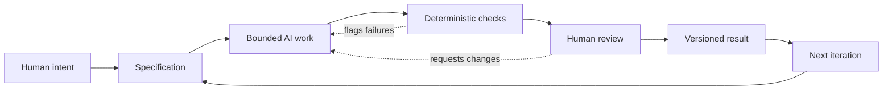

# Chapter 5 — Synthesis: Directing AI With Meaning

## The Three Lenses

The first four chapters have approached creative work from different directions.

Persuasion asks what a design is trying to do to attention, interpretation, desire, or action.

Archetypes ask what kind of meaning or identity a brand is expressing.

Design language asks how that meaning becomes visible through typography, image, composition, structure, interaction, and other formal choices.

These are not three unrelated subjects.

They form a practical control framework:

> **Persuasion helps answer: What response are we trying to enable?**  
> **Archetype helps answer: What meaning or identity are we expressing?**  
> **Design language helps answer: How should that meaning look and feel?**

Put together, the three lenses turn a vague creative request into a more useful brief.

---

## From "Make Something Good" to a Directed Brief

Consider two instructions given to an AI assistant.

### Instruction A

> Make a website for our white T-shirt.

There is very little for the system to reason about.

What audience?

What response?

What identity?

What visual language?

What must be true?

What must not change?

What counts as success?

### Instruction B

> Create a product page for a high-quality plain white T-shirt aimed at customers who value understated simplicity. Use a restrained Sage archetype. The desired response is confidence in the product's quality rather than excitement about novelty. Use a modernist, Swiss-influenced visual language: strong hierarchy, disciplined grid, generous whitespace, restrained typography, and precise product imagery. Do not invent material, manufacturing, or performance claims. The page must include product details, price, sizing, and a clear purchase path.

The second instruction gives the AI a much smaller and more meaningful space in which to make decisions.

That is the point of a good specification.

**A specification does not eliminate creativity. It directs creativity.**

---

# The Control Framework

A useful sequence is:

### 1. Persuasion — What response?

Decide what the work should enable.

Examples:

- trust
- curiosity
- recognition
- action
- comparison
- confidence
- belonging
- exploration

Be careful with the word "response."

You are not necessarily trying to manipulate someone into doing something against their interests. A responsible persuasive goal can be to help someone understand a choice, notice relevant information, or act on a genuine need.

### 2. Archetype — What meaning?

Choose the kind of identity or cultural role the work should express.

Examples:

- Sage
- Explorer
- Jester
- Everyperson

The archetype should help constrain tone and interpretation.

It should not become a stereotype or a substitute for audience research.

### 3. Design Language — How should it appear?

Translate the intended meaning into formal decisions.

Examples:

- grid
- hierarchy
- typography
- color
- image treatment
- spacing
- motion
- density
- interaction
- degree of visual disruption

This is where historical knowledge becomes practical.

A Swiss-influenced system and a postmodern collage can communicate very different attitudes even when they contain the same words.

---

# Why This Matters When Directing AI

AI systems are unusually good at producing variations.

That strength creates a problem.

If the task is underspecified, the system can generate many plausible answers without knowing which differences matter.

You may receive:

- five different tones
- three unrelated visual directions
- invented details
- inconsistent terminology
- unnecessary complexity
- attractive but strategically irrelevant ideas

The issue is not simply that the AI "got it wrong."

The task may not have told it what "right" meant.

A useful AI workflow therefore separates **creative freedom** from **decision boundaries**.

Give the system room to explore inside the problem.

Make the problem itself explicit.

---

# Specification: Define the Playing Field

A specification is a bounded description of the work.

It can include:

## Purpose

Why is this artifact being created?

## Audience

Who is expected to use, read, see, or interact with it?

## Desired response

What should the work help the audience understand, feel, consider, or do?

## Meaning and identity

What archetype, attitude, or position should the work express?

## Design language

What visual or interaction system should guide the work?

## Requirements

What must be present?

## Constraints

What must not happen?

## Acceptance criteria

How will we know whether the result meets the brief?

## Evidence

Which claims, data, references, or source materials must be verified?

## Deliverable

What exact file, format, structure, or interface should be produced?

The specification is especially important when the output is generated repeatedly.

Without it, each generation can quietly redefine the task.

---

# Deterministic Checks: Cheap Questions With Definite Answers

Some questions do not require taste.

They require a check.

For example:

- Does the required file exist?
- Is the filename correct?
- Is the document valid Markdown?
- Are all required headings present?
- Is the Mermaid block syntactically complete?
- Does the code compile?
- Does a test suite pass?
- Are required links present?
- Does a JSON file parse?
- Does the generated output contain prohibited placeholder text?

These are excellent candidates for **deterministic automated checks**.

A deterministic check should produce a repeatable result from the same input.

For example:

> "Does `book/05-synthesis.md` contain the heading `## Questions for Next Week`?"

That can be checked mechanically.

The check does not need an opinion.

Automation is valuable here because these checks are:

- cheap
- fast
- repeatable
- consistent
- easy to rerun after changes

Do not ask an AI reviewer to spend expensive reasoning effort answering a question that a simple script can answer exactly.

---

# Probabilistic Review: Questions Without One Mechanical Answer

Other questions are different.

Consider:

> Does the chapter actually teach a first-year student something useful?

There is no simple universal test for that.

Or:

> Does the archetype feel coherent with the visual language?

Or:

> Is the tone appropriate?

Or:

> Does the explanation accidentally imply something misleading?

These are judgment-heavy questions.

AI can help review them.

It can look for:

- contradictions
- missing explanations
- unclear transitions
- repeated ideas
- unsupported claims
- inconsistent terminology
- likely reader confusion
- mismatches between requirements and output

But AI review is **probabilistic**.

It can miss a problem.

It can identify a problem that is not actually a problem.

It can produce a confident explanation for a weak interpretation.

Therefore:

> **AI review is evidence for a decision, not the decision itself.**

---

# Human Judgment: The Expensive Part That Matters

Humans remain responsible for questions involving:

- meaning
- truthfulness
- context
- taste
- ethics
- audience interpretation
- strategic priorities
- risk
- final approval

This does not mean humans should manually inspect every character of every generated artifact.

That would waste the advantages of automation.

Instead, human judgment should be concentrated where it has the most value.

Think of the workflow like a race-car pit stop.

---

# The Pit-Stop Metaphor

A race car cannot stop for a full inspection after every few meters.

The team uses systems to keep the car moving.

Sensors and automated processes can continuously monitor many conditions.

But at selected moments, the car enters the pit.

People inspect the parts that deserve deliberate attention.

AI-assisted creative work can operate similarly.

**Automation keeps running.**

It can:

- generate
- format
- test
- lint
- compare
- check
- summarize
- flag

But selected moments deserve a human pit stop.

At that moment, ask:

- Is this actually what we meant?
- Is it truthful?
- Is it appropriate for the audience?
- Does the visual language support the intended meaning?
- Did the AI introduce an assumption we did not authorize?
- Is the result useful enough to keep?
- What changed from the previous version?
- Should we ship this?

The goal is not maximum human involvement.

The goal is **high-value human involvement**.

---

# The Complete Workflow

A practical AI-assisted workflow can therefore be organized as:

Each stage has a different job.

### Human intent

A person decides what matters.

This is the source of purpose and priority.

### Specification

The intent becomes explicit enough to guide work.

This is where requirements, constraints, audience, meaning, and acceptance criteria become concrete.

### Bounded AI work

The AI generates, transforms, analyzes, or implements within those boundaries.

The system can explore possibilities without redefining the assignment.

### Deterministic checks

Cheap, repeatable questions are answered automatically.

Failures should be surfaced early.

### Human review

A person inspects meaning, truth, context, quality, and important ambiguities.

### Versioned result

The accepted state is recorded so the team can understand what happened and recover if needed.

### Next iteration

The cycle repeats.

The important insight is that the workflow is not:

> Human → AI → Finished

It is:

> **Human intent → specification → bounded generation → checks → judgment → versioned result → iteration**

---

# Why Git Matters

When AI is generating work, version control becomes more important, not less.

AI can produce large amounts of change quickly.

That is useful.

It is also dangerous.

A generated change can:

- modify many files
- rewrite wording
- introduce a subtle regression
- remove something that looked unnecessary
- change dependencies
- alter formatting
- replace a working approach with a plausible but weaker one

If there is no record of previous states, recovery becomes difficult.

Git provides a history of changes.

That history supports:

- **traceability** — what changed?
- **comparison** — how is this version different?
- **recovery** — can we return to a known-good state?
- **attribution of decisions** — which change produced the current behavior?
- **experimentation** — can we try an alternative without losing the current version?

Version control changes the psychology of experimentation.

If recovery is easy, it becomes safer to explore.

---

# Versioning Is Part of Creative Control

Suppose an AI assistant produces three possible directions for the white T-shirt campaign.

Without version control, the process may become:

> "I think the second one was better, but then we changed it and now I can't remember what was different."

With version control, the process can become:

- Version A: restrained modernist
- Version B: Explorer
- Version C: disruptive postmodern
- Version D: revised Explorer with stronger product evidence

Now the team can compare actual states.

This matters because memory is a poor version-control system.

A person may remember the general impression of an earlier design while forgetting the exact wording, spacing, code, file structure, or constraint that made it work.

---

# Specification + Checks + Git

These three mechanisms solve different problems.

| Mechanism | Main Question | Strength |
|---|---|---|
| **Specification** | What are we trying to make? | Defines the boundary |
| **Deterministic checks** | Does the output satisfy mechanical requirements? | Cheap and repeatable |
| **AI review** | What might be unclear, inconsistent, or weak? | Broad probabilistic analysis |
| **Human review** | Is this meaningful, truthful, appropriate, and worth keeping? | Context and judgment |
| **Git / version control** | What changed, and can we recover? | Traceability and recovery |

Do not collapse these into one "quality check."

They operate at different levels.

---

# A Worked Example

Suppose the task is:

> Create a product page for the plain white T-shirt using the Explorer concept.

A useful specification might say:

### Goal

Create a product page that makes the shirt feel like a simple, dependable companion for travel.

### Audience

People who value mobility, discovery, and uncomplicated products.

### Archetype

Explorer.

### Persuasive response

Encourage interest by associating the shirt with readiness and freedom without making unsupported performance claims.

### Visual language

Spacious photography, movement, travel context, strong product visibility, restrained supporting typography, and subtle directional graphics.

### Required content

- product name
- price
- size information
- material information from the supplied product data
- care information from the supplied product data
- purchase action

### Constraints

- Do not invent technical performance.
- Do not claim sustainability without evidence.
- Do not change the physical product specification.
- Do not bury price or material information beneath decorative copy.
- Keep the shirt visually identifiable.

### Acceptance criteria

- Required content is present.
- Product facts match the supplied source.
- The visual system consistently expresses the Explorer direction.
- The page remains usable at the target viewport sizes.
- Automated structural checks pass.
- A human reviewer approves the final meaning and claims.

Now the AI has a real problem to solve.

It still has creative freedom.

But it is no longer guessing what the assignment is.

---

# What AI Should and Should Not Own

A useful division of labor looks like this.

## AI Is Well Suited To

- generating alternatives
- transforming formats
- drafting copy
- producing code
- checking patterns
- finding inconsistencies
- summarizing large inputs
- proposing visual directions
- running repeatable transformations
- suggesting edge cases
- performing first-pass reviews

## Humans Should Retain Responsibility For

- defining purpose
- deciding what matters
- approving factual claims
- evaluating cultural context
- deciding whether a representation is appropriate
- resolving ambiguity
- judging strategic fit
- accepting ethical risk
- approving the final artifact

This is not a claim that AI can never perform these activities.

It is a workflow principle:

> **The more consequential the judgment, the more important it is to establish accountable human ownership.**

---

# The Three Lenses as AI Prompts

The framework can be turned directly into prompting questions.

Instead of writing:

> Make this more premium.

Ask:

### Persuasion

> What response should this design enable from the audience?

Then specify:

> The audience should feel confident enough to investigate the product and understand why it is worth considering.

### Archetype

> What identity or meaning should the brand express?

Then specify:

> Use the Sage archetype: knowledgeable, restrained, considered, and confident without sounding superior.

### Design Language

> What visual system should carry that meaning?

Then specify:

> Use a restrained modernist language with a strong grid, clear hierarchy, generous whitespace, precise product photography, and limited typographic variation.

The resulting prompt is much more actionable.

---

# A Prompt Pattern You Can Reuse

For future AI-assisted work, try this structure:

> **Purpose:** [what the work is for]  
> **Audience:** [who it is for]  
> **Desired response:** [what response the work should enable]  
> **Meaning / archetype:** [identity or cultural meaning]  
> **Design language:** [visual or interaction system]  
> **Required elements:** [what must exist]  
> **Constraints:** [what must not happen]  
> **Evidence:** [what source material must be treated as authoritative]  
> **Acceptance criteria:** [how the result will be checked]  
> **Deliverable:** [exact output format and location]  
> **Review:** [what should be checked automatically and what requires human judgment]

This is not a magic formula.

It is a way of making hidden decisions visible.

---

# A Note About "Creative Freedom"

Students sometimes worry that specifications make creative work boring.

The opposite can happen.

If the boundaries are clear, the AI can explore within them.

For example:

> "Create three different Explorer directions for the same shirt. Keep the product facts fixed, but vary the photography, typography, composition, and narrative."

That is a highly constrained task.

It can also produce dramatically different results.

Constraints create a meaningful comparison.

Without constraints, differences may simply be noise.

---

# The Final Principle

The most important shift is to stop thinking of AI as the author of the assignment.

The human defines the problem.

The AI helps explore the solution space.

Automation checks what can be checked cheaply.

AI review helps identify probable problems.

Version control records the evolving artifact.

Human judgment decides what the work means, whether it is truthful and appropriate, and whether it should be accepted.

That is a more durable model of AI-assisted work than:

> "Tell the AI to make something good."

---

# Questions for Next Week

1. **What part of your current creative workflow is underspecified?**

2. **Which decisions could be expressed as explicit acceptance criteria?**

3. **Which checks could be made deterministic instead of reviewed manually?**

4. **Which questions require interpretation rather than mechanical validation?**

5. **Where could an AI system accidentally invent facts or assumptions?**

6. **What should a human inspect at the equivalent of a "pit stop"?**

7. **Which files or artifacts should be versioned so that recovery is easy?**

8. **Can you describe one project using the three lenses: persuasion, archetype, and design language?**

9. **What does your audience actually need to understand before they act?**

10. **What should the AI be allowed to change—and what must remain under human control?**

---

# What You Should Remember

1. **Persuasion, archetypes, and design language form a useful three-lens framework.** Persuasion asks what response we are trying to enable; archetype asks what meaning or identity we are expressing; design language asks how that meaning should look and feel.

2. **AI works better when the problem is bounded.** A clear specification gives the system purpose, audience, requirements, constraints, evidence, and acceptance criteria.

3. **Deterministic checks should handle deterministic questions.** Use automation for cheap, repeatable validation wherever possible.

4. **AI review is useful but probabilistic.** It can identify likely problems, but its judgment can be wrong and should not replace accountable review.

5. **Humans remain responsible for meaning, truthfulness, context, ethics, and final decisions.**

6. **Human review should be selective and deliberate.** Like a race-car pit stop, it should focus attention where inspection and judgment have the highest value.

7. **Git provides traceability and recovery.** When AI can generate changes quickly, a reliable history becomes a practical safety mechanism for experimentation.

8. **Version control is not only for programmers.** Any evolving AI-generated artifact can benefit from knowing what changed and being able to return to a known-good state.

9. **Good AI direction is not about removing creativity.** It is about creating a useful space in which creativity can operate.

10. **The durable workflow is a loop:** human intent → specification → bounded AI work → deterministic checks → human review → versioned result → next iteration.

The goal is not to make AI perfectly autonomous.

The goal is to make AI-assisted work **intentional, inspectable, recoverable, and accountable**.
